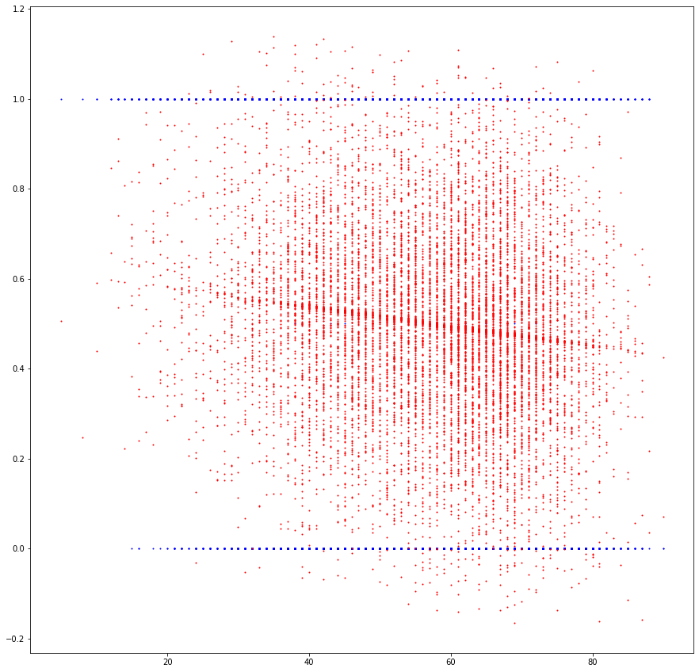

# Code developement catalog

### 5/19/20

Review starter code and began developement on basic features by modifying "GinRummyGame.java", through basic linear regression visualization.

**Features**: scores, deadwood count, numOptions -> current player wins hand, wins game

current_player_deadwood vs. is_current_player_hand_winner:

---
