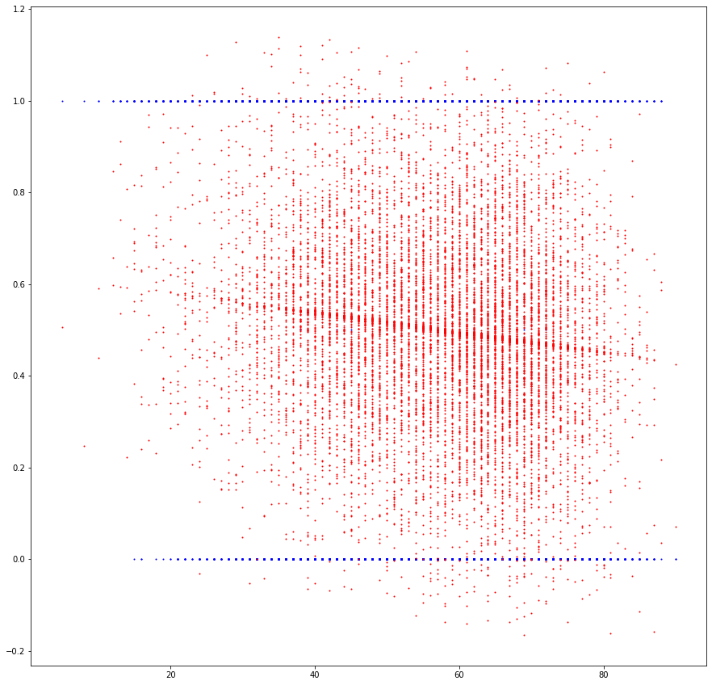
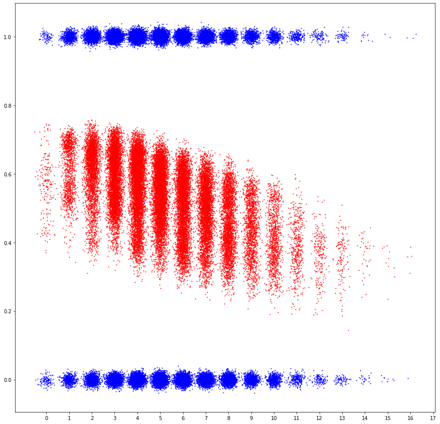
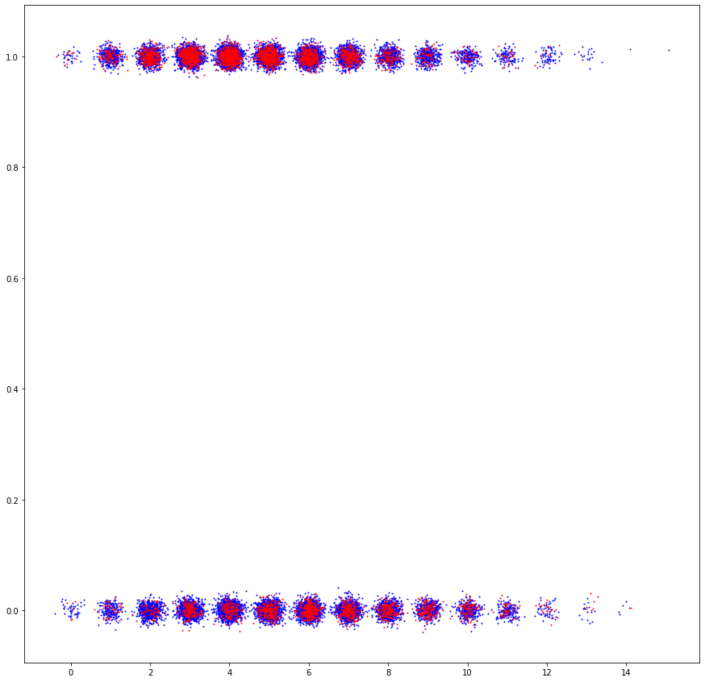

discrepanciesdiscrepancies # Code developement catalog

## Standard Cycle of developement

### Preliminary

- Make a player that, when confronted with a decision, uses features about its own game state and pre-calculated data to probabilistically decide which choice will lead to a most probable win.
    - `Player`, does the playing and calls
    - `BlackBox` which runs the probability function on the game state, using
    - `OurUtilities` which has a function that calculates all of the features of the player
- Make a way to save features about game states and their respective winner outcomes (`Collect`)
- Make a dummy player (`SimpleGinRummyPlayer`)

### Cycle
- Add features to `OurUtilities.calculateFeatures()`
    - The .csv output in the header of `Collect` also needs to be changed
- Have the current version `Player` play itself multiple times
    - It uses the `OurUtilities.calculateFeatures()` but only regards the features that are used in the regression for the player's `version` and `type`
- Collect the data from the games (all possible features and results)
- Do a regression analysis on the data that predicts the result from the features
    - the features of one player state is a vector. The regression gives us another vector of coefficients with which to dot any feature vector and get an approximation of the outcome (plus a constant)
- Add the line of coefficients to the list of coefficient versions
- Change the player to be the next version
- Repeat

----

## Week 1

### Tuesday 5/19/20

Review starter code and began development on basic features by modifying "GinRummyGame.java", through basic linear regression visualization.

**Features**: scores, deadwood count, numOptions -> current player wins hand, wins game

current_player_deadwood vs. is_current_player_hand_winner:

---

### Wednesday 5/20/20

Today we finished developing the alpha data production collection. Set up jupyter notebook for linear and logistic regression. Added many utilities involving hit cards. Started work on another simple player based on hit cards as well as melds and deadwood.

current_player_num_hit_cards vs. is_current_player_hand_winner (linear)

current_player_num_hit_cards vs. is_current_player_hand_winner (logistic)

### Thursday 5/21/20

Made `BlackBox` and `Player` class for data driven function generation development. Made and deleted the `State` class. Got a regression image that was more accurate (not including the hand winner as input). Modeled a decision tree regarding a maximization problem in the `Player` class. Learned about how the `GinRummyGame` interface works with the `Player` classes by attempting to cheat.

### Friday 5/21/20

We fixed the alpha player from making most illegal moves. Added 9 features to `OurUtilities.calculateFeatures()` for progress on the Beta Player.

## Week 2

### Monday 5/25/20

Alpha playing SimpleGinRummyPlayer for 1000 games: alpha (517), simple (483). Debugged data collection ("Debug-Monday").

### Tuesday 5/26/20

Debugged ("Debug-Tuesday"). Found 2 errors in provided code, found some errors in our code as well.
> seed 268 (alpha versus alpha) -- exception to 3 turn first face up rule

> card getShuffle() needs to use the seed
> SimpleGinRummyPlayer needs seed as well if we are using seeds

Started work on working backwards towards the SimpleGinRummyPlayer so that we could find where in our process we deviated from good data. Calculated distributions and plotted them. Did a lot of comparisons between the Alpha player and the SimpleGinRummyPlayer to determine how we weren't able to replicate our earlier data.

We think that the issue lies in how we had calculated `num_hit_cards` before and after we factored out calculating features to `OurUtilities`.

### Wednesday 5/27/20

Debug Wednesday -- why the new data collection is different from the original system (specifically number of hit cards is off). Somewhat fixed this issue and reduced the number of discrepancies in one game with seed 0 to five. We need to heavily clean the `Player` class. Specifically, `unknownCards` needs to be fixed.

### Thursday 5/28/20

Debug Thursday. Had Brown Bag lunch with other X-SIG participants. Fixed the `Player` class. Good Stuff!
Added the Quadratic model Player Type by multiplying every two possible features.

### Friday 5/29/20

Added new feature "num_nearby_opponent_cards" to new player GAMMA. Started development of neural network.
Collecting points at ABCD beats players at AD and CD (by a lot). Confused to why data collection at non-decision making states improves win rate than data collected just at decision making states.
Added feature 'num_vis_cards_to_opponent' to the new player DELTA.

nearbyCards() works as follows: find with multiplicity the adjacent cards to each card in the ArrayList provided.

Tried acquiring regression coefficients from neural networks, based on the features that were working.

## Week 3

### Monday 6/1/20

Made `Request` class and python server, to communicate with more complex python models. It takes 24ms round trip so it is a little too slow.

### Tuesday 6/2/20

Got H2O model development and exportation to `GinRummyAI` functional. Researched Gradient Boosted Decision trees. Need to rework `Player` and `BlackBox` for efficiency and clarity.

### Wednesday 6/3/20

Used XGBoost and debugged the regression model. We are somehow processing data incorrectly on our side.
